# Fase 1 — Sistema de estilo y esqueleto visual

**Cerrada el:** 04/10/2026
**Tareas:** 14 de 14
**Resultado:** la aplicación entera está maquetada y navegable en el celular, con un sistema de estilo donde ningún componente puede inventar un color, una medida ni una sombra.

> **https://epic-wallet-v2.vercel.app**

---

## 1. Para qué sirvió esta fase

La fase 0 puso la aplicación en internet. Esta la hizo verse y recorrerse.

Al terminar, Epic Wallet tiene sus siete pantallas con la estructura definitiva, datos de ejemplo en todas, navegación que funciona con el botón "atrás" del navegador, tema claro y oscuro, y un catálogo de piezas —tarjetas, filas, hojas, avisos— que las fases siguientes van a usar sin tener que decidir nada visual otra vez.

**No hay ni una línea de lógica de negocio.** Ningún filtro filtra, ningún gráfico se dibuja, ningún conmutador cambia datos. Eso es a propósito: separar el "cómo se ve" del "qué hace" permite que Gustavo apruebe lo visual antes de que haya nada que romper.

---

## 2. Qué quedó construido

| | Qué | Dónde |
|---|---|---|
| **Tokens** | 101 variables de color, medida, sombra y curva; 45 cambian con el tema | `web/src/styles/tokens.css` |
| **Base** | Fondo de lavados radiales, capa de ruido, escala tipográfica por rol | `web/src/styles/base.css` |
| **Componentes** | Las dos capas de vidrio y todo el catálogo | `web/src/styles/components.css` |
| **Enrutador** | Siete rutas por hash, con historial y botón "atrás" | `web/src/js/router.js` |
| **Catálogo** | Tarjetas, filas, hojas, avisos, notificaciones, estados | `web/src/js/components/` |
| **Vistas** | Las siete pantallas con datos de ejemplo | `web/src/js/views/vistas.js` |
| **Datos de ejemplo** | Todos en un archivo, para reemplazarlos de una vez | `web/src/js/datos-muestra.js` |
| **Pruebas** | 301 de pytest y 121 de jsdom | `tests/` |
| **Capturas** | 34, en claro y oscuro, a ancho de teléfono y de escritorio | `docs/capturas/` |

---

## 3. Cómo se ve

### En el teléfono

| Inicio | Alertas | Movimientos |
|---|---|---|
| 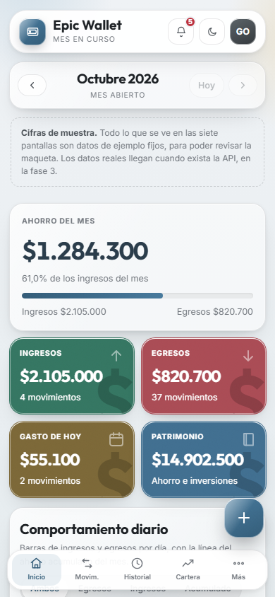 | 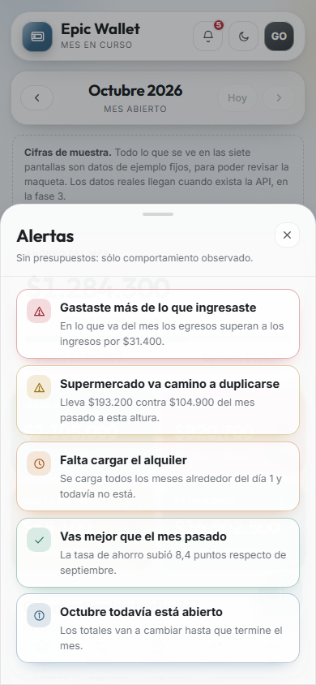 | 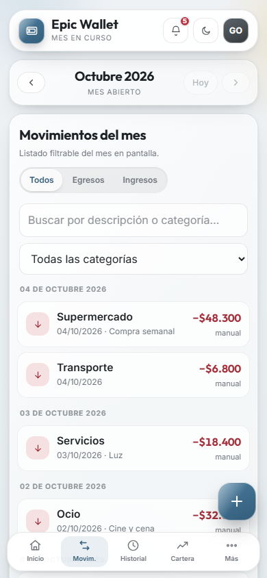 |
| 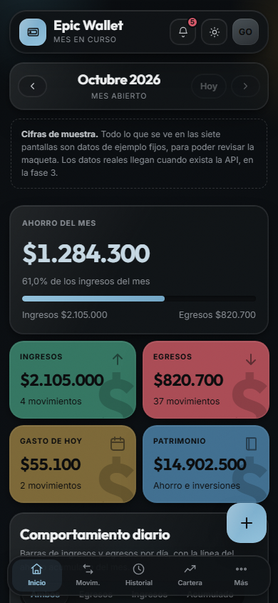 | 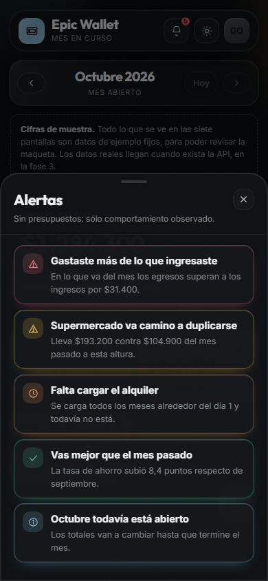 | 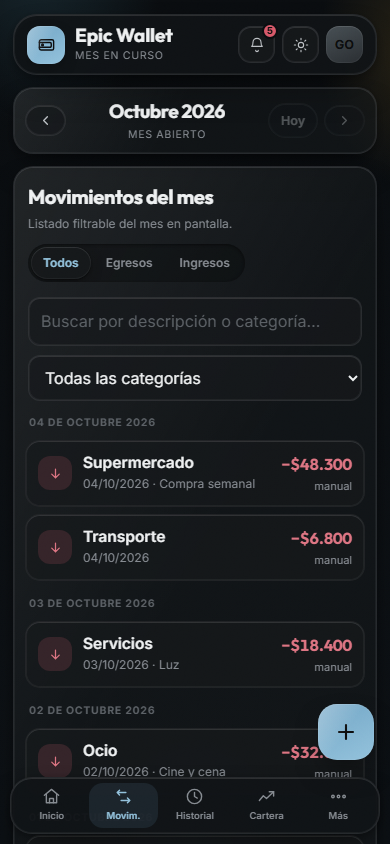 |

| Historial | Cartera | Patrimonio |
|---|---|---|
| 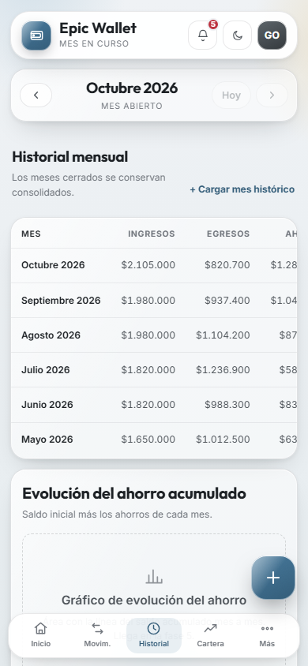 | 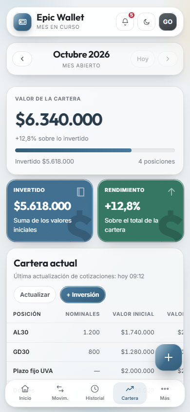 | 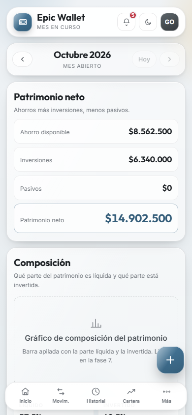 |
| 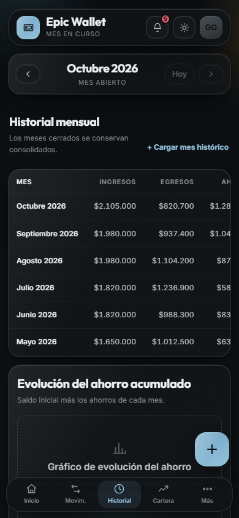 | 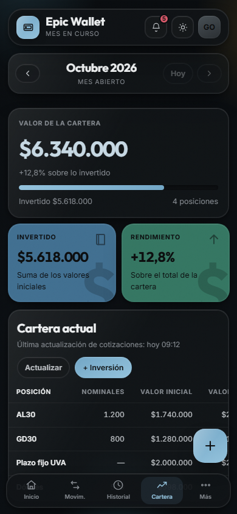 | 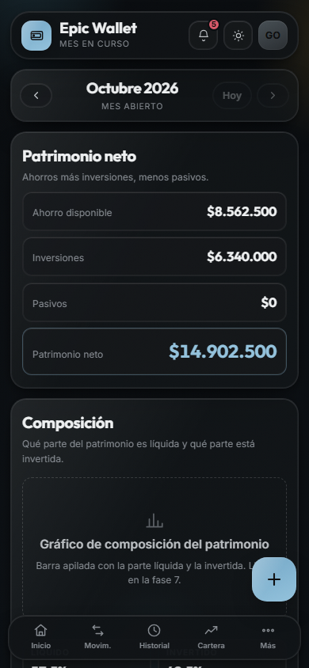 |

| Análisis | Ajustes | Hoja "Más" |
|---|---|---|
| 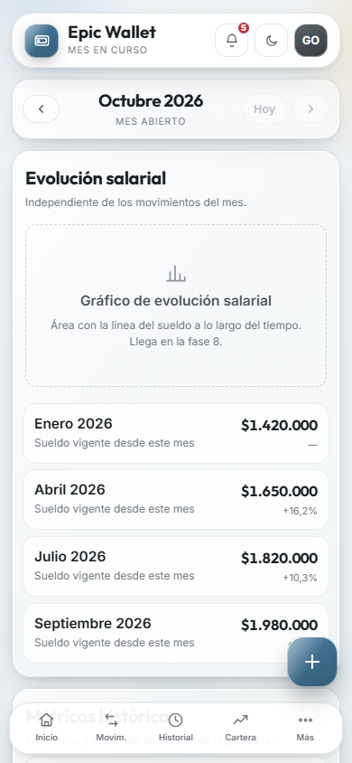 | 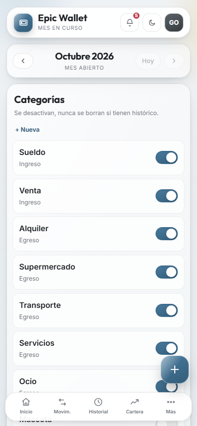 | 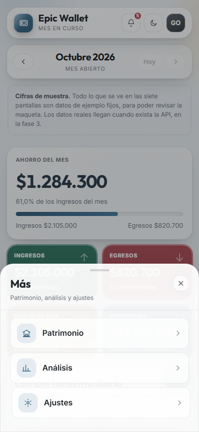 |
| 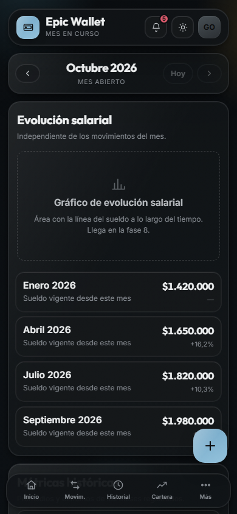 | 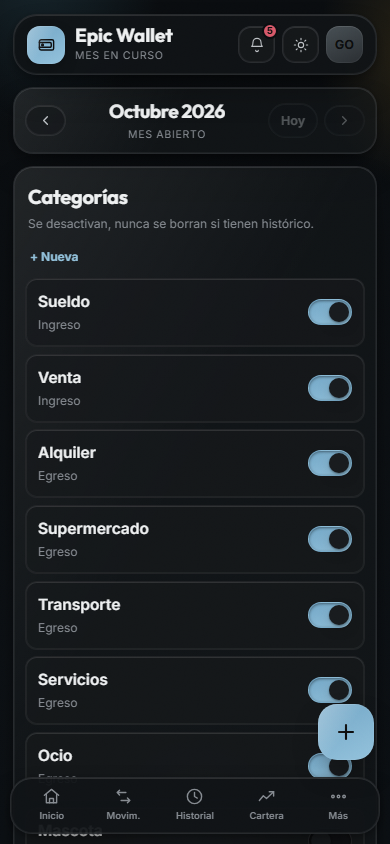 | 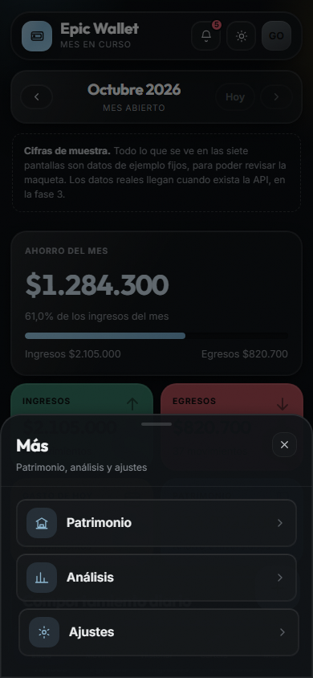 |

### En escritorio

| Inicio | Historial |
|---|---|
| 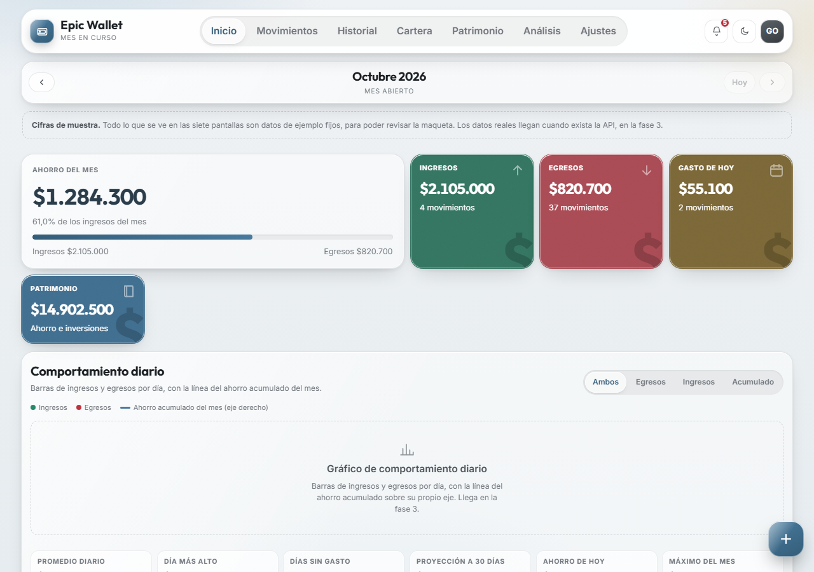 | 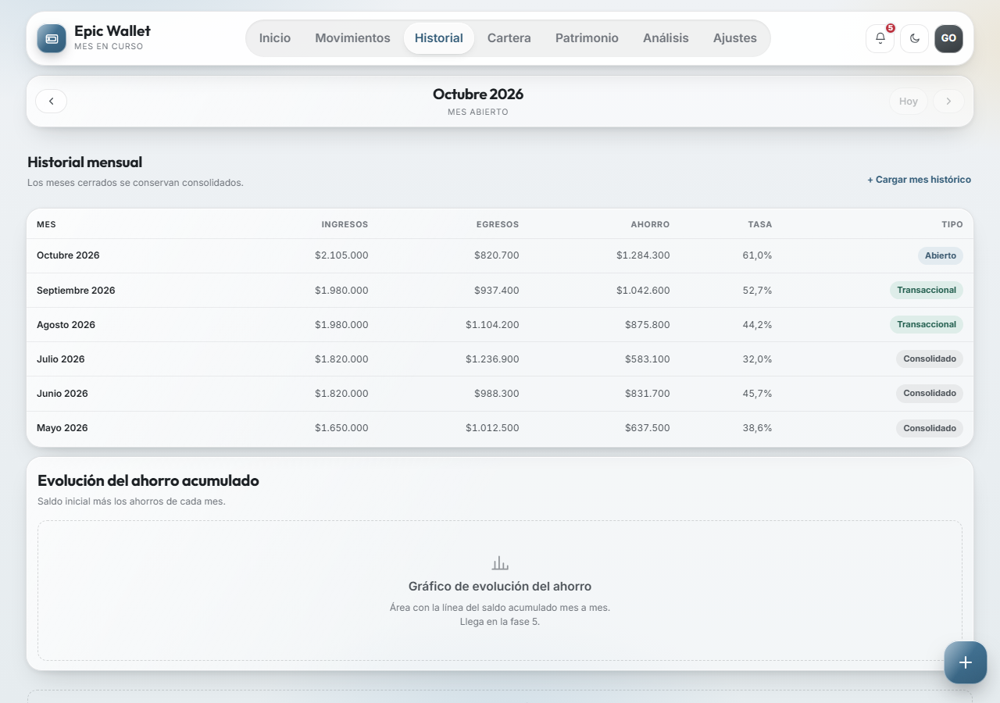 |
| 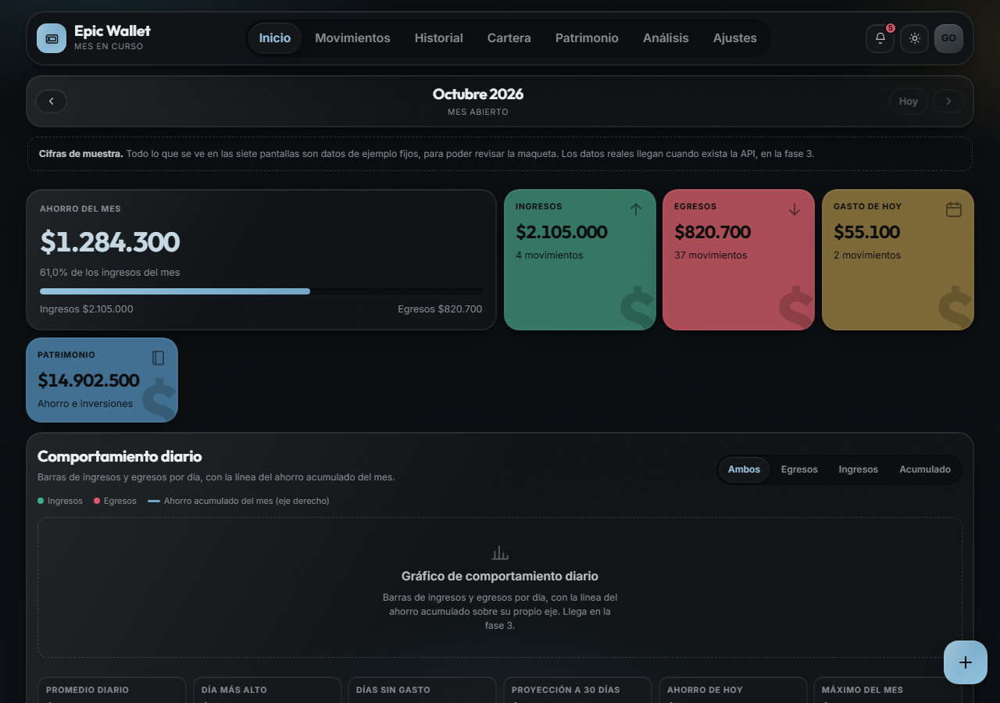 | 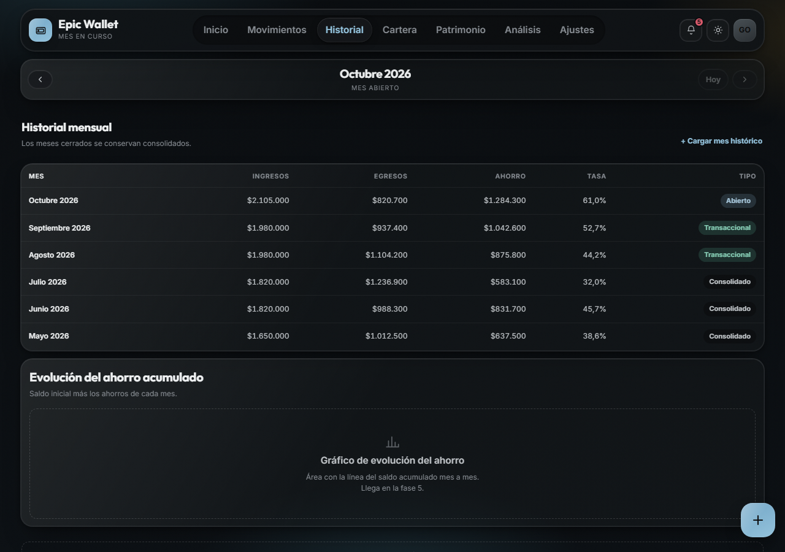 |

Las 34 capturas están en [`docs/capturas/`](capturas/). Se rehacen con un comando:

```bash
npm run capturas                              # contra producción
npm run capturas -- http://localhost:3000     # contra una copia local
```

Se versiona el script y no sólo las imágenes: cuando el diseño cambie, las capturas se regeneran en lugar de quedar viejas en este documento.

---

## 4. La identidad: "Vidrio Grafito"

Superficies translúcidas con desenfoque y un brillo diagonal, sobre un fondo de lavados radiales fríos y cálidos, con una capa de ruido muy sutil que evita el aspecto plástico.

Tres reglas la sostienen:

1. **Ningún valor de color, sombra o radio se escribe fuera de los tokens.** Si hace falta uno nuevo, se agrega al archivo de tokens —en los tres bloques— y nunca suelto en un componente. Hay pruebas que recorren el CSS y fallan si aparece un `#hex`, un `rgba()` o un `border-radius` a mano.
2. **El color significa, no decora.** Ingreso, egreso, ahorro, severidad. Y nunca es el único portador: un ingreso lleva además el signo `+` y una flecha hacia arriba.
3. **Mobile-first de verdad.** El CSS base es el del teléfono y lo demás se agrega con `min-width`. Nunca al revés.

---

## 5. El cuadro de tokens

Esta tabla **se genera desde `tokens.css`**, no se escribe a mano:

```bash
python scripts/tabla-tokens.py
```

Una tabla copiada queda vieja en cuanto alguien toca un token, y nadie se entera hasta que usa un valor que ya no existe. `tests/unit/test_documentacion.py` comprueba que coincidan.

<!-- TOKENS:INICIO -->

#### Fondo y lavados

El ambiente sobre el que flota todo.

| Token | Claro | Oscuro |
|---|---|---|
| `--color-bg-1` | `#eff2f5` | `#0a0d10` |
| `--color-bg-2` | `#e6ecef` | `#0c1014` |
| `--color-wash-a` | `#d1dfe8` | `#17272e` |
| `--color-wash-b` | `#ebe4d3` | `#262114` |

#### Tinta

Cuatro niveles de jerarquía, calibrados por contraste.

| Token | Claro | Oscuro |
|---|---|---|
| `--color-ink` | `#1c2024` | `#eef0f1` |
| `--color-ink-2` | `#4b5157` | `#bcc0c4` |
| `--color-ink-3` | `#70757c` | `#868b91` |
| `--color-ink-4` | `#8f9398` | `#5c6166` |

#### Acento

El azul grafito que da identidad.

| Token | Claro | Oscuro |
|---|---|---|
| `--color-accent` | `#47799c` | `#72a6c6` |
| `--color-accent-2` | `#335c78` | `#93c2dc` |
| `--color-accent-soft` | `#dfeaf0` | `#111f27` |
| `--color-navy` | `#11181f` | `#040608` |
| `--color-on-accent` | `#ffffff` | `#0c0d0e` |

#### Semántica financiera

Ingreso, egreso y ahorro.

| Token | Claro | Oscuro |
|---|---|---|
| `--color-egr` | `#bc313e` | `#d8596a` |
| `--color-inc` | `#26886a` | `#3cb087` |
| `--color-sav` | `#47799c` | `#72a6c6` |

#### Severidad

Las cuatro de los avisos.

| Token | Claro | Oscuro |
|---|---|---|
| `--color-crit` | `#bc313e` | `#d8596a` |
| `--color-ok` | `#26886a` | `#3cb087` |
| `--color-pend` | `#c56b24` | `#dc8642` |
| `--color-warn` | `#c08e19` | `#daa932` |

#### Tarjetas de color

Fondo sólido del tablero. No cambian con el tema.

| Token | Claro | Oscuro |
|---|---|---|
| `--color-card-dia` | `#7c6838` | *igual* |
| `--color-card-egr` | `#aa4c55` | *igual* |
| `--color-card-inc` | `#357662` | *igual* |
| `--color-card-pat` | `#416f90` | *igual* |

#### Avatar y decoración

| Token | Claro | Oscuro |
|---|---|---|
| `--color-avatar-1` | `#5c6469` | `#474f54` |
| `--color-avatar-2` | `#33383c` | `#2a2e32` |
| `--glifo-op` | `0.5` | *igual* |
| `--peso-sombra` | `rgba(0, 0, 0, 0.18)` | *igual* |

#### Líneas

| Token | Claro | Oscuro |
|---|---|---|
| `--line` | `rgba(28, 32, 36, 0.1)` | `rgba(238, 240, 241, 0.1)` |
| `--line-2` | `rgba(28, 32, 36, 0.07)` | `rgba(238, 240, 241, 0.06)` |
| `--line-strong` | `rgba(28, 32, 36, 0.16)` | `rgba(238, 240, 241, 0.16)` |

#### Vidrio

Las dos capas, más el de las barras y las hojas.

| Token | Claro | Oscuro |
|---|---|---|
| `--glass-bar-bg` | `rgba(255, 255, 255, 0.94)` | `rgba(16, 19, 22, 0.95)` |
| `--glass-bar-blur` | `10px` | *igual* |
| `--glass-bar-fallback` | `rgba(255, 255, 255, 0.985)` | `rgba(14, 17, 20, 0.99)` |
| `--glass-content-bg` | `rgba(255, 255, 255, 0.68)` | `rgba(22, 25, 28, 0.72)` |
| `--glass-content-blur` | `7px` | *igual* |
| `--glass-content-fallback` | `rgba(255, 255, 255, 0.94)` | `rgba(13, 15, 17, 0.96)` |
| `--glass-in` | `inset 0 1px 0 rgba(255, 255, 255, 0.85), inset 0 0 0 1px rgba(255, 255, 255, 0.45)` | `inset 0 1px 0 rgba(255, 255, 255, 0.07), inset 0 0 0 1px rgba(255, 255, 255, 0.05)` |
| `--glass-sheen` | `linear-gradient( 120deg, rgba(255, 255, 255, 0.55), transparent 45% )` | `linear-gradient( 120deg, rgba(255, 255, 255, 0.07), transparent 45% )` |
| `--glass-shell-bg` | `rgba(255, 255, 255, 0.52)` | `rgba(22, 25, 28, 0.5)` |
| `--glass-shell-blur` | `22px` | *igual* |
| `--glass-shell-fallback` | `rgba(255, 255, 255, 0.92)` | `rgba(13, 15, 17, 0.94)` |

#### Sombras y mezclas

| Token | Claro | Oscuro |
|---|---|---|
| `--accent-ring` | `rgba(71, 121, 156, 0.28)` | `rgba(114, 166, 198, 0.3)` |
| `--groove-bg` | `rgba(20, 22, 25, 0.06)` | `rgba(0, 0, 0, 0.26)` |
| `--groove-in` | `inset 0 1px 3px rgba(0, 0, 0, 0.08)` | `inset 0 1px 3px rgba(0, 0, 0, 0.45)` |
| `--mix-ink` | `#1c2024` | `#f2f4f5` |
| `--mix-tint` | `#fff` | `#181b1e` |
| `--scrim` | `rgba(10, 12, 14, 0.34)` | `rgba(0, 0, 0, 0.52)` |
| `--scrim-0` | `rgba(10, 12, 14, 0)` | `rgba(0, 0, 0, 0)` |
| `--sh-lg` | `0 4px 16px rgba(var(--shadow-rgb), 0.09), 0 34px 70px -26px rgba(var(--shadow-rgb), 0.32)` | `0 4px 18px rgba(0, 0, 0, 0.4), 0 40px 80px -28px rgba(0, 0, 0, 0.65)` |
| `--sh-md` | `0 2px 6px rgba(var(--shadow-rgb), 0.07), 0 16px 34px -16px rgba(var(--shadow-rgb), 0.22)` | `0 2px 8px rgba(0, 0, 0, 0.35), 0 18px 38px -16px rgba(0, 0, 0, 0.55)` |
| `--sh-sm` | `0 1px 2px rgba(var(--shadow-rgb), 0.06), 0 4px 12px -4px rgba(var(--shadow-rgb), 0.12)` | `0 1px 2px rgba(0, 0, 0, 0.4), 0 4px 14px -4px rgba(0, 0, 0, 0.5)` |
| `--shadow-rgb` | `20, 22, 25` | `0, 0, 0` |
| `--solid-sheen` | `linear-gradient( 125deg, rgba(255, 255, 255, 0.55), transparent 50% )` | `linear-gradient( 125deg, rgba(255, 255, 255, 0.34), transparent 50% )` |

#### Radios

| Token | Claro | Oscuro |
|---|---|---|
| `--radius-aviso` | `10px` | *igual* |
| `--radius-bar` | `22px` | *igual* |
| `--radius-btn` | `13px` | *igual* |
| `--radius-card` | `20px` | *igual* |
| `--radius-enlace` | `8px` | *igual* |
| `--radius-fab` | `19px` | *igual* |
| `--radius-ico` | `9px` | *igual* |
| `--radius-lg` | `24px` | *igual* |
| `--radius-linea` | `2px` | *igual* |
| `--radius-nav` | `14px` | *igual* |
| `--radius-row` | `15px` | *igual* |
| `--radius-sheet` | `26px` | *igual* |
| `--radius-sm` | `12px` | *igual* |
| `--radius-tilde` | `7px` | *igual* |
| `--radius-toast` | `16px` | *igual* |

#### Tipografía

Un tamaño por ROL, nunca por medida.

| Token | Claro | Oscuro |
|---|---|---|
| `--font-display` | `Outfit, sans-serif` | *igual* |
| `--font-sans` | `Inter, ui-sans-serif, system-ui, sans-serif` | *igual* |
| `--text-amount` | `33px` | *igual* |
| `--text-amount-row` | `16px` | *igual* |
| `--text-avatar` | `12.5px` | *igual* |
| `--text-aviso` | `14.5px` | *igual* |
| `--text-axis` | `10px` | *igual* |
| `--text-axis-sm` | `9.5px` | *igual* |
| `--text-badge` | `9.5px` | *igual* |
| `--text-base` | `16.5px` | *igual* |
| `--text-button` | `15.5px` | *igual* |
| `--text-campo-movil` | `16px` | *igual* |
| `--text-chip` | `12.5px` | *igual* |
| `--text-hero` | `35px` | *igual* |
| `--text-kpi` | `27.5px` | *igual* |
| `--text-kpi-sm` | `23px` | *igual* |
| `--text-kv` | `16.5px` | *igual* |
| `--text-label` | `10.5px` | *igual* |
| `--text-marca` | `14px` | *igual* |
| `--text-nav` | `9.5px` | *igual* |
| `--text-panel` | `20px` | *igual* |
| `--text-peso` | `104px` | *igual* |
| `--text-peso-sm` | `92px` | *igual* |
| `--text-pill` | `11px` | *igual* |
| `--text-row` | `15.5px` | *igual* |
| `--text-section` | `19px` | *igual* |
| `--text-sheet` | `21.5px` | *igual* |
| `--text-sub` | `12px` | *igual* |
| `--tracking-caps` | `0.07em` | *igual* |
| `--tracking-label` | `0.05em` | *igual* |

#### Movimiento

| Token | Claro | Oscuro |
|---|---|---|
| `--ease` | `cubic-bezier(0.32, 0.72, 0, 1)` | *igual* |
| `--ease-glass` | `cubic-bezier(0.32, 0.72, 0, 1)` | *igual* |

**101 tokens en total**, de los cuales **45 se redefinen en el tema oscuro.** Los que no aparecen en la columna oscura son los mismos en los dos temas: medidas, curvas y las tarjetas de color.

<!-- TOKENS:FIN -->

---

## 6. Las dos capas de vidrio

Toda la profundidad sale de dos clases. **No se inventan variantes.**

| Clase | Para qué | Desenfoque |
|---|---|---|
| `.shell` | Contenedores: paneles, tarjetas, hojas | 22 px |
| `.cg` | Contenido dentro de un `.shell`: filas, fichas, campos | 7 px |

```html
<article class="card shell">
  <div class="card-head">
    <div><h2>Gastos por categoría</h2><p>Tocá una para ver sus movimientos.</p></div>
  </div>
  <div class="rows">
    <button class="row cg" type="button">…</button>
  </div>
</article>
```

**El bloque de degradación no es opcional.** Donde no hay `backdrop-filter`, el texto queda sobre un fondo semitransparente sin desenfocar, o sea ilegible:

```css
@supports not ((backdrop-filter: blur(1px)) or (-webkit-backdrop-filter: blur(1px))) {
  .shell { background: var(--glass-shell-fallback); }
  .cg    { background: var(--glass-content-fallback) !important; }
}
```

### Un tercer vidrio, que apareció usando la aplicación

La barra superior, la barra inferior y las hojas **no pueden llevar el vidrio de una tarjeta.** Tienen texto chico encima y pasan por delante de todo el contenido: con 52% de opacidad, las letras se mezclan con lo que pasa por detrás. Llevan `--glass-bar-bg`, que es casi opaco, con el desenfoque al mínimo y **sin el brillo diagonal** —un degradado blanco encima de una etiqueta de 9,5 px es la diferencia entre leerla y no.

---

## 7. La escala tipográfica

`Outfit` para cifras y títulos, `Inter` para todo lo demás. Base 16,5 px.

**Un tamaño por ROL, nunca por medida.** Un componente pide "cifra de indicador", no "27,5 px". Así la escala se ajusta en un solo lugar, y hay una prueba que falla si aparece un `font-size` con un número suelto.

| Rol | Token | Tamaño |
|---|---|---|
| Cifra héroe | `--text-hero` | 35 px |
| Importe en formulario | `--text-amount` | 33 px |
| Cifra de indicador | `--text-kpi` | 27,5 px |
| Cifra de indicador secundario | `--text-kpi-sm` | 23 px |
| Título de hoja | `--text-sheet` | 21,5 px |
| Título de panel | `--text-panel` | 20 px |
| Título de sección | `--text-section` | 19 px |
| Texto corriente | `--text-base` | 16,5 px |
| Nombre en fila | `--text-row` | 15,5 px |
| Píldora de acción | `--text-chip` | 12,5 px |
| Secundario de fila | `--text-sub` | 12 px |
| Etiqueta de indicador | `--text-label` | 10,5 px |
| Etiqueta de barra inferior | `--text-nav` | 9,5 px |

Las cifras llevan `font-variant-numeric: tabular-nums` **siempre**: sin eso, al actualizarse un importe las cifras cambian de ancho y la fila entera se mueve.

---

## 8. Los puntos de corte

| Corte | Ancho | Qué cambia |
|---|---|---|
| base | < 640 px | Una columna. Indicadores en 2. Barra inferior y botón flotante. Hojas desde abajo. |
| `sm` | ≥ 640 px | Indicadores en 4 columnas. |
| `md` | ≥ 720 px | Cabeceras de panel en una fila. |
| — | ≥ 900 px | El detalle pasa a cajón lateral; el formulario, a modal centrado. |
| `lg` | ≥ 960 px | Navegación arriba en lugar de abajo. Paneles en dos columnas. |
| `xl` | ≥ 1024 px | Indicadores en 6 columnas. |

Áreas táctiles de **44 × 44 px** como mínimo, y `env(safe-area-inset-bottom)` respetado en todo lo que vive abajo.

---

## 9. El catálogo de componentes

Funciones que reciben datos y devuelven un string de HTML. Sin ciclo de vida ni estado interno.

**Todo dato pasa por `esc()` antes de entrar en una plantilla.** No es una recomendación: una descripción de movimiento que diga `<script>` tiene que verse como texto.

### Tarjeta de indicador


```javascript
import { tarjetaHeroe, tarjetaMetrica, pintarTarjetas } from "./components/kpi.js";

pintarTarjetas(document.getElementById("kpis-inicio"), [
  tarjetaHeroe({
    etiqueta: "Ahorro del mes",
    cifra: "$1.284.300",
    sub: "61,0% de los ingresos del mes",
    porcentaje: 61,
    pieIzq: "Ingresos $2.105.000",
    pieDer: "Egresos $820.700",
    color: "sav",
  }),
  tarjetaMetrica({
    etiqueta: "Ingresos",
    cifra: "$2.105.000",
    sub: "4 movimientos",
    tarjeta: "inc",          // inc · egr · dia · pat
  }),
]);
```

Con `tarjeta` pasa a ser una de las cuatro de color: fondo sólido, texto blanco, el signo pesos de fondo y el símbolo que la identifica.

### Fila de lista

```javascript
import { filaMovimiento, filaCategoria, separadorDia, pintarFilas } from "./components/rows.js";

pintarFilas(document.getElementById("movimientos-lista"), [
  separadorDia("04 de octubre 2026"),
  filaMovimiento({
    id: 1,
    tipo: "egreso",                 // decide el signo, el color y la flecha
    categoria: "Supermercado",
    importe: "$48.300",             // ya formateado: el frontend no calcula
    fecha: "04/10/2026",
    descripcion: "Compra semanal",
    origen: "manual",
  }),
  filaCategoria({
    id: "alquiler",
    nombre: "Alquiler",
    total: "$520.000",
    detalle: "1 movimiento · 63,4% del gasto",
    participacion: 100,             // 0–100, se recorta
    pie: "últ. 01/10",
  }),
]);
```

### Hoja y cajón


```javascript
import { crearHoja } from "./components/sheet.js";

const hoja = crearHoja(document.getElementById("hoja-alertas"), {
  disparador: document.getElementById("btn-alertas"),
});
hoja.abrir();
```

```html
<aside class="hoja hoja--modal" id="hoja-alertas" role="dialog" aria-modal="true"
       aria-labelledby="t" aria-hidden="true" tabindex="-1">
  <div class="hoja-asa" aria-hidden="true"></div>
  <div class="hoja-cabeza">
    <div><h2 id="t">Alertas</h2><p>…</p></div>
    <button class="hoja-cerrar" type="button" data-cerrar aria-label="Cerrar">…</button>
  </div>
  <div class="hoja-cuerpo">…</div>
</aside>
```

`.hoja--cajon` entra por la derecha desde 900 px (para ver un detalle sin perder la lista); `.hoja--modal` se centra (para lo que pide atención completa).

### Avisos, píldoras y notificaciones

```javascript
import { aviso, pildora } from "./components/avisos.js";
import { toast } from "./components/toast.js";

aviso({ severidad: "crit", titulo: "Gastaste más de lo que ingresaste", texto: "…" });
pildora({ texto: "Consolidado", tipo: "neutral" });

toast("Movimiento guardado");
toast("No se pudo guardar", { severidad: "crit" });
```

Severidades: `ok`, `warn`, `pend`, `crit` e `info`. Cada una lleva su icono **con nombre leíble**, no oculto: sin eso, un aviso crítico y uno informativo se leen idénticos en un lector de pantalla.

### Los cuatro estados

```javascript
import { bloqueCargando, error, vacio, consolidado } from "./components/estados.js";

caja.innerHTML = bloqueCargando("fila", 4);
caja.innerHTML = error("No se pudieron cargar los movimientos.");
caja.innerHTML = vacio("Todavía no cargaste nada", "Tocá el + para empezar.");
caja.innerHTML = consolidado();   // mes histórico: NO es lo mismo que vacío
```

### Navegación

```javascript
import { navegar, rutaActual, EVENTO } from "./router.js";

navegar("movimientos");
document.addEventListener(EVENTO, (ev) => marcar(ev.detail.id));
```

**Nadie lee la ruta del DOM ni del hash**: se escucha `epic:ruta`. Así las dos barras no se ponen de acuerdo entre ellas sino cada una con el enrutador, y quedan bien también al llegar por "atrás" o por recarga.

---

## 10. La regla que sostiene todo

> **Ningún componente nuevo introduce valores fuera de los tokens.**

No es una convención de buena voluntad: hay pruebas que la hacen cumplir.

| Prueba | Qué impide |
|---|---|
| `test_ningun_color_fuera_de_tokens` | un `#hex` o un `rgba()` en un componente |
| `test_ningun_radio_fuera_de_tokens` | un `border-radius` con un número suelto |
| `test_ningun_tamano_de_fuente_suelto` | un `font-size` que no venga de un rol |
| `test_toda_variable_tiene_version_oscura` | un token que exista sólo en claro |
| `test_todo_var_usado_existe_de_verdad` | usar un token que nunca se definió |
| `test_la_tinta_contrasta_sobre_el_vidrio` | bajar el contraste por debajo del mínimo |
| `test_la_skill_no_miente_sobre_los_colores` | que la referencia de diseño quede vieja |

Cuando hace falta un valor nuevo, el camino es: agregarlo a `tokens.css` en los tres bloques, usarlo, y —si no cambia con el tema— declararlo invariante en la prueba. Si falta un paso, la suite avisa.

---

## 11. Diez cosas que descubrimos en el camino

Casi todas aparecieron midiendo o mutando el código, no leyéndolo.

### Un `var()` sin definir no avisa

Si un `var(--x)` no existe, el navegador **descarta la declaración entera en silencio**. Ocho tokens que se creían agregados nunca habían entrado al archivo, y la barra inferior, el botón flotante y la hoja estuvieron en producción con las esquinas **cuadradas** desde la tarea 6. Las pruebas no lo veían porque comprobaban que el CSS *usara* `var(--radius-*)`, nunca que el token existiera.

### Las barras necesitaban su propio vidrio

Con el de una tarjeta, el contraste de la etiqueta de la barra inferior **no llegaba al mínimo**. La misma corrección hizo falta después en las hojas, por el mismo motivo: son superficies con texto que pasan por delante del contenido.

### El signo pesos de las tarjetas tiene que ir oscuro

El diseño original lo tenía claro. Así, la cifra blanca que le cae encima baja de 5:1 a **3,3:1** — y no se arregla bajándole la opacidad: ni al 10% llega. Oscureciéndolo sube a **6,8:1**: decoración que además ayuda a leer.

### El ámbar y el naranja no se pueden distinguir con color

Entre `warn` y `pend` la distancia es de **7 sobre 765** en el fondo de una píldora y de **31** en el texto. Ninguna proporción los separa. Por eso la regla del sistema no es "que los colores se distingan" sino que **el color no sea el único portador**: cada severidad lleva su icono y su nombre.

### El foco tiene que ganarle al hover

`:focus-visible` pone el halo con menos especificidad que `.row:hover`, que reemplaza `box-shadow` entero. Al pasar el dedo por una fila enfocada, **el halo desaparecía**. Vale para cualquier componente que cambie sombras en hover.

### `overflow: hidden` no bloquea el scroll en iOS

Es lo que se usa habitualmente y **iOS lo ignora** para el scroller del documento: el fondo se sigue moviendo detrás de la hoja. Hay que fijar el documento, lo que lo hace saltar al principio, así que además hay que guardar la posición y devolverla al cerrar.

### Una región `aria-live` tiene que existir antes del mensaje

Un lector anuncia los **cambios** dentro de la región. Creada junto con el texto, no hay cambio que anunciar y el mensaje pasa en silencio. Por eso el `<div>` del toast está en el HTML, vacío, desde que carga la página.

### El movimiento reducido anula la duración, no el retardo

El bloque de `prefers-reduced-motion` anulaba la duración de las animaciones pero no el `animation-delay`. Las tarjetas seguían apareciendo de a una, sólo que de golpe.

### Un esqueleto permanente se lee como un error

Los gráficos que faltan estaban marcados con el esqueleto de carga, y un esqueleto que brilla para siempre dice "esto está cargando". Gustavo preguntó si era un error — y tenía razón en preguntarlo. Ahora cada marcador dice **qué** gráfico va ahí y **en qué fase** llega.

### Una prueba que mira el código fuente puede aprobarse sola

Varias pruebas buscaban una cadena en un archivo y la encontraban **en su propio comentario explicativo**. Y la del `<script>` inyectado daba confianza falsa: un `<script>` insertado con `innerHTML` no se ejecuta ni en un navegador real, así que pasaba sin que el escape hiciera nada. Las que valen usan ``.

---

## 12. Cómo se verificó

Dos suites, un solo comando.

```bash
pytest                      # 301 pruebas, incluidas las de JavaScript
npm test                    # las 121 de jsdom, por separado
```

`pytest` invoca `node --test` y falla si esas pruebas fallan: así no quedan fuera de la verificación por olvido, y la cuenta de pruebas declaradas se compara con la de pruebas pasadas para detectar un archivo que dejó de correrse.

**Lo que no se puede probar con una prueba estática, se prueba con jsdom.** Recargar en una ruta, volver con "atrás", el foco atrapado dentro de una hoja, dos mensajes que no se pisan: nada de eso se verifica leyendo código.

**Y las pruebas se verificaron mutando el código.** En cada tarea se cambió algo que debería romperlas, para confirmar que las rompe. De ahí salieron la mitad de los hallazgos del punto 11: pruebas que pasaban sin probar nada.

---

## 13. Lo que quedó pendiente

| Qué | Cuándo |
|---|---|
| Los gráficos: el diario, el de seis meses, el de ahorro, el de patrimonio y el salarial | Fases 3, 5, 7 y 8 |
| Que los filtros filtren y los conmutadores cambien el gráfico | Fases 4 y 6 |
| Formato de importes en el cliente (`fmt`, `fmtS`, `fmtK`, `pct`) | Fase 5 |
| Que los cuatro estados se disparen de verdad | Fase 3, con la API |
| Entorno de preview con su propio esquema | F08-T13 |

---

## 14. Para la fase que viene

La fase 2 es **cuentas de usuario**: login con correo y contraseña, registro y sesión. Lo que esta fase deja listo para eso:

- Las pantallas sin sesión se arman con el mismo catálogo: una tarjeta de vidrio centrada, campos `.inp`, botones `.chip.solid` y avisos para los errores.
- El enrutador ya separa rutas públicas de privadas en su diseño.
- La notificación breve existe para "no se pudo entrar" sin inventar nada.

**Y la regla sigue valiendo**: si una pantalla de login necesita un color que no está, se agrega a `tokens.css` en los tres bloques. No se escribe en el componente.
